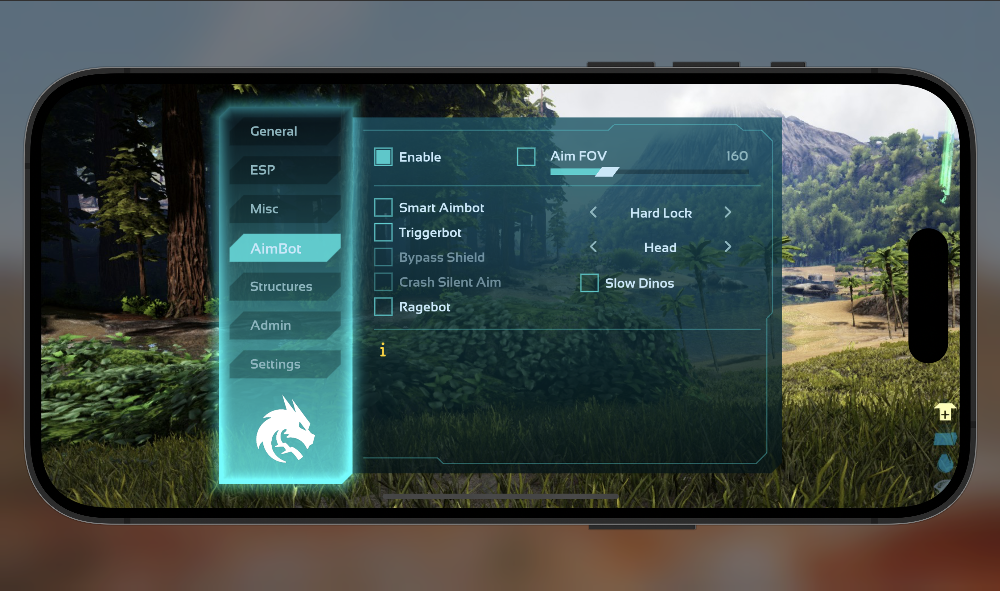
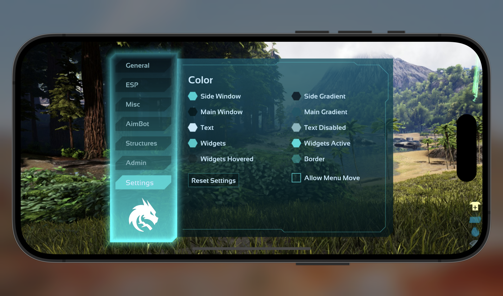

# **Dragon** Tool

Advanced **iOS** mod for **Ark: Survival Evolved Mobile (Unsupported)**

Made by [OPSphystech420](https://github.com/OPSphystech420) , [ZarakiDev](https://github.com/ZarakiDev) Aug 2025 (c)

## Disclaimer

The source code of this project is published on GitHub solely for educational and research purposes.

This repository is not intended to provide instructions or guidance on how to build, compile, inject, deploy, or use the project. It must not be used for malicious, unauthorized, or unlawful activities.

Any use of this source code is entirely at the user’s own risk and responsibility. The authors and contributors accept no liability for any damage, misuse, or legal consequences resulting from its use.

# Preview

## General

  
   
  
  
   
  

## ESP

  
   
  
  
   
  

## Misc

  
   
  
  
   

## AimBot

## Structures

  
   
  
  
   

## Admin

  
   
  
  
   
   
   

## Settings

